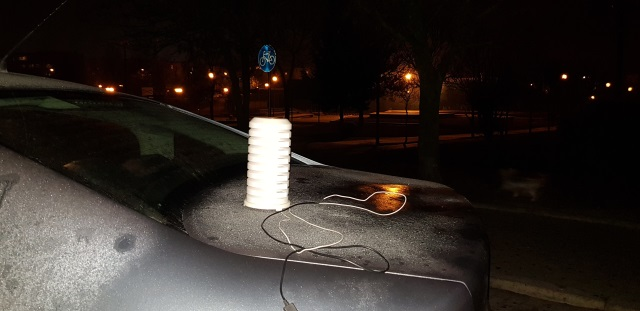

# Air Quality Monitoring Station (AQMS)

After a long time I decided to share my Personal Weather Station.  
It is based on my PMS library (https://github.com/fu-hsi/PMS).

## Installation

**Configuration**

Before uploading code, change configuration:
```cpp
// Don't touch this ;-)
// #define FU_PROFILE

#ifdef FU_PROFILE
#include "Settings.h"
#else
// Debug (D4)
#define DBG Serial1

// Webservice
static const char* WS_UA = "AQMS/2.0";
static const char* WS_TOKEN = "YOUR TOKEN";
static const char* WS_URL = "YOUR SERVER SCRIPT";

// Wireless credentials
static const char* WL_SSID = "YOUR SSID";
static const char* WL_PASS = "YOUR PASSWORD";
static const uint8_t WL_CHANNEL = 0;

// OTA credentials
static const char* BE_USERNAME = "admin";
static const char* BE_PASSWORD = "admin";

// PMS configuration (INTERVAL & DELAY can't be equal!!!)
static const uint32_t PMS_READ_INTERVAL = 150000;
static const uint32_t PMS_READ_DELAY = 30000;

// Takes N samples and counts the average
static const uint8_t PMS_READ_SAMPLES = 2;
#endif // FU_PROFILE
```

**Board settings**


**Board identification**

If you have any problems, use flashInfo() function to identify board or [CheckFlashConfig.ino](https://github.com/esp8266/Arduino/blob/master/libraries/esp8266/examples/CheckFlashConfig/CheckFlashConfig.ino) (it's the same).
This is very imporant for OTA update.

**Circuit**

I don't have necessary components for Fritzing, sorry...

| Component       | WeMos           | Note
| --------------- | --------------- |
| Debug output    | D4              |
| Battery monitor | A1              | 100k resistor in series (max. 4.2V).
| PMS7003         | TX  => RX<br>RX  => TX<br>VCC => 5V<br>GND   => GND | Disconnect before programming via a usb port!
| SHT31-D         | SDA => D1<br>SCL => D2<br>VCC => 3.3V<br>GND => GND | For temperature and humidity (built-in heater).
| BME280          | SDA => D1<br>SCL => D2<br>VCC => 3.3V<br>GND => GND | For pressure and temperature (temperature and humidity as backup).

**Alternative sensors**

I testet many sensors... The following list shows my ranking.

| Rank    | Sensor  | Note
| ------- | ------- | ------- |
| 1       | SHT31-D | Temperature, Humidity (built-in heater, Filter Caps are also available).
| 2       | BMP280  | Temperature, Pressure.
| 3       | BMP180  | Temperature, Pressure.
| 4       | BME280  | Temperature, Humidity, Pressure.
| 5       | DHT22 (AM2302) | Temperature, Humidity.

Don't use BME280 for measuring temperature... I get readings overstated more than 2°C.  
DHT22 is also a bad choice for measuring humidity.  
Best combo for me is SHT31-D with BMP280, but BMP280 stopped working properly before publishing this project and I use BME280 now.

## Dashboard


## Components
- Radiation shield TFA 98.1114.02 
- Wemos D1 ESP-WROOM-02
- Plantower PMS7003
- SHT31-D
- BME280

## Measured values
- Pollution
- Temperature and humidity
- Pressure
- Battery voltage

## Additional features
- OTA update over Wi-Fi
- Sending data to the server
- Mobility (Lithium-ion battery)
- Battery monitor
- File logging

## Working time
Up to **8 hours** with listed conditions:
- Default configuration
- Li-Ion ~1500mAh
- Temperature ~3°C

## Photos

### Rev. 1
In surface mounted S-BOX 116B IP65 (old hardware).


### Rev. 2
Merged with my previous meteorological station in the radiation shield.


Mounted on the balcony and powered through a thin cable connected to a PC USB.  
USB socket in WeMos was removed (accidentally ;-).


Couple pictures from inside.


### Database

**Table structure**
```sql
CREATE TABLE `weather_pms` (
  `id` int(10) unsigned NOT NULL AUTO_INCREMENT,
  `dt` timestamp NOT NULL DEFAULT CURRENT_TIMESTAMP,
  `pm1` smallint(6) DEFAULT NULL,
  `pm25` smallint(6) DEFAULT NULL,
  `pm10` smallint(6) DEFAULT NULL,
  `rv` smallint(6) DEFAULT NULL,
  `v` float(4,2) DEFAULT NULL,
  `temperature` float(4,2) DEFAULT NULL,
  `humidity` float(4,2) DEFAULT NULL,
  `pressure` float(6,2) DEFAULT NULL,
  `bm280_temp` float(4,2) DEFAULT NULL,
  `bm280_hum` float(4,2) DEFAULT NULL,
  PRIMARY KEY (`id`)
) ENGINE=InnoDB AUTO_INCREMENT=146810 DEFAULT CHARSET=utf8;
```

**Sample data**

```
    id                   dt     pm1    pm25    pm10      rv       v  temperature  humidity  pressure  bm280_temp  bm280_hum  
------  -------------------  ------  ------  ------  ------  ------  -----------  --------  --------  ----------  -----------
146810  2018-12-17 22:00:57      22      40      52    1024    4.20        -0.79     95.15   1008.28       -0.26        81.28
146809  2018-12-17 21:57:57      26      44      66    1024    4.20        -0.72     94.94   1008.31       -0.17        80.95
146808  2018-12-17 21:54:57      22      36      40    1024    4.20        -0.76     94.93   1008.31       -0.28        81.25
146807  2018-12-17 21:51:57      18      34      43    1024    4.20        -0.79     95.20   1008.26       -0.17        81.19
146806  2018-12-17 21:48:57      16      34      50    1024    4.20        -0.92     95.49   1008.25       -0.35        81.66
146805  2018-12-17 21:45:57      22      40      52    1024    4.20        -0.93     95.45   1008.27       -0.41        81.77
```

## Server
I have PHP script on my VPS server where I receive POST data.
These data are then sent (after some calculations) to:
- SQL Database
- https://thingspeak.com/
- https://www.wunderground.com/

What calculations do I mean? For example:
- Reduced pressure
- Heat Index
- Dev Point

I also reject the results below a certain voltage.

For simplicity, I share only a basic [ws.php](ws.php) script. Rest is in your gesture.

```php
<?php
error_reporting(0);
ini_set('display_errors', 0);
date_default_timezone_set('Europe/Warsaw');

// define('FU_PROFILE', true);

if (defined('FU_PROFILE')) {
    require_once 'config.php';
} else {
    define('WS_TOKEN', 'YOUR TOKEN');

    define('DB_HOST', 'YOUR DB HOST');
    define('DB_USER', 'YOUR DB USER');
    define('DB_PASS', 'YOUR DB PASS');
    define('DB_NAME', 'YOUR DB NAME');
}

class DB
{
    private static $db = null;
    private function __construct()
    {}
    public static function getConnection()
    {
        if (self::$db == null) {
            $dsn = sprintf('mysql:dbname=%s;host=%s', DB_NAME, DB_HOST);
            $options = array(
                PDO::MYSQL_ATTR_INIT_COMMAND => "SET NAMES utf8",
                PDO::ATTR_ERRMODE => PDO::ERRMODE_SILENT,
                PDO::ATTR_DEFAULT_FETCH_MODE => PDO::FETCH_ASSOC,
            );
            self::$db = new PDO($dsn, DB_USER, DB_PASS, $options);
        }
        return self::$db;
    }
}

if (!empty($_SERVER['HTTP_X_TOKEN']) && $_SERVER['HTTP_X_TOKEN'] == WS_TOKEN) {
 
  // Allowed fields
  $whiteList = [
    'pm1', 'pm25', 'pm10',
    'rv', 'v',
    'temperature', 'humidity', 'pressure', 'bm280_temp', 'bm280_hum'
  ];  

  // Clear array
  $whiteList = array_fill_keys($whiteList, NULL);

  // Prepare array
  $storeData = [];
  $storeData = array_merge($storeData, $whiteList, array_intersect_key($_POST, $whiteList));

  try {   
    $db = DB::getConnection();
    $stm = $db->prepare('INSERT INTO weather_pms SET dt = NOW(), ' . implode(',', array_map(function ($key) {
      return $key . ' = :' . $key;
    }, array_keys($storeData))));
    $stm->execute($storeData);   
  } catch(PDOException $e) {
    exit('DB error');
  }

}
?>
```

## Typical flow


## Todo
- Add a GPS module for use in the field (https://github.com/fu-hsi/FuGPS).  
UTC time from GPS is an extra bonus for work in offline mode.

